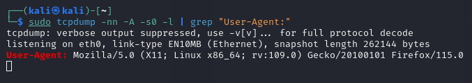

# Pentesting-24-h0


## Capture and analyze network traffic

Task is to analyze anything in the network and write a short report about it.

### Using tcpdump to extract http user agents
```
sudo tcpdump -nn -A -s0 -l | grep "User-Agent:"  
```
Command breakdown

``` -nn ```
  disables hostname resolving.

``` -A ```
  enables output to include ASCII strings

``` -s0 ```
  size of the packet we capture, 0 = unlimited.

``` -l ```
  Line buffered mode, displays capture in realtime

``` | grep "User-Agent:" ```
  finds the row containgin "user-agent:"

### Result

  After running the command, i open the browser on the same host, and go to google.com

  

The captured packet contains parsed info about browser and operating system

### Tools used

tcpdump
firefox


### Resources:

https://hackertarget.com/tcpdump-examples/

