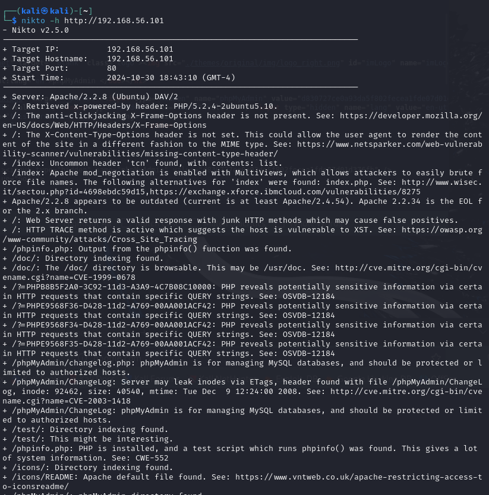

<a name="hackers-journey"></a>

# H1 - 🕵️‍♂️ Hacker's journey

This is Homework 1 from pentesting course by Tero Karvinen @ Haaga-helia university of applied sciences


<a name="contents"></a>

## 📑 Contents

- [🕵️‍♂️ H1 - Hacker's journey](#h1---hackers-journey)
  - [📑 Contents](#contents)
  - [📋 Assignments:](#assignments)
  - [📝 X) Summarization task](#x-summarization-task)
    - [🎙️ Podcast Herrasmieshakkerit ep 0x06](#podcast-herrasmieshakkerit-ep-0x06)
    - [🔗 Hutchins intrusion kill chain](#hutchins-intrusion-kill-chain)
    - [🎥 O'Reilly Active recon videos](#oreilly-active-recon-videos)
    - [⚖️ KKO2003:36](#kko200336)
  - [💿 A) Install kali](#a-install-kali)
  - [🌐 B) Disconnect kali from network](#b-disconnect-kali-from-network)
  - [🔍 C) Port scan localhost](#c-port-scan-localhost)
  - [🔧 D) Install daemons and portscan again](#d-install-daemons-and-portscan-again)
  - [💻 E) Install metasploitable 2 to a VM](#e-install-metasploitable-2-to-a-vm)
  - [🔌 F) Setup network between VM:s](#f-setup-network-between-vms)
  - [📡 G) Finding metasploit server with kali](#g-finding-metasploit-server-with-kali)
  - [🛰️ H) Port scanning the target (metasploitable 2)](#h-port-scanning-the-target-metasploitable-2)
  - [📂 Resources](#resources)

<a name="assignments"></a>

## 📋 Assignments:

<details>
  <summary>Click to expand</summary>

x) Read/watch/listen and summarize. (There is no need to take tests on the computer in this subsection x, just reading or listening and summarizing is enough. A few lines of French are enough for summarizing.)

Herrasmieshackkerit (RSS) or Darknet Diaries (RSS), one free episode of either. You can also listen while jogging, mowing the laundry, etc. Clean home / good condition on sale.

Hutchins et al 2011: Intelligence-Driven Computer Network Defense Informed by Analysis of Adversary Campaigns and Intrusion Kill Chains, chapters Abstract, 3.2 Intrusion Kill Chain.

€ Santos et al: The Art of Hacking (Video Collection): 4.3 Surveying Essential Tools for Active Reconnaissance. Includes port scanning. 5 videos, a total of about 20 min.

KKO 2003:36.

a) Install Kali virtual machine. 

b) Disconnect the Kali virtual machine from the network. Prove with tests that the machine cannot connect to the Internet (e.g. 'ping 8.8.8.8')

c) Port scan the 1000 most common tcp ports from your own machine (nmap -A localhost). Analyze the results.

d) Install two optional daemons and rescan. Analyze and explain the differences.

e) Install Metasploitable 2 virtual machine

f) Make a virtual network between the machines. 

g) Find Metasploitable by portscanning (nmap -sn). Check with your browser that you found the correct IP - Metasploitable's web server's front page says Metasploitable.

h) Portscan Metasploitable carefully and all ports (nmap -A -p-). Pick 2-3 gates most interesting to the attacker. Analyze and explain the results for these gates.

</details>

<a name="x-summarization-task"></a>

## 📝 X) Summarization task

<a name="podcast-herrasmieshakkerit-ep-0x06"></a>

### 🎙️ Podcast Herrasmieshakkerit ep 0x06

The podcast talking points are about how to get into the field of cybersecurity and what skills are required in the field, as well as job interview situations. The field is usually specialized through already strong other general IT skills, and with the help of a strong hobby.

At the beginning of the podcast, they discuss the scope of the cybersec specializations, like: programming, administrative tasks, networks, radio networks, cryptography, pentesting.. etc.

Also mentioned as a tip for anyone intrested in the field, to document or blog about things while learning, to build portfolio, much similiar as we document these assignments to github.

<a name="hutchins-intrusion-kill-chain"></a>

### 🔗 Hutchins intrusion kill chain

The Hutchins intrusion kill chain is the most common process of cyber attacking, the process is as following:

1. Reconnaissance:
Discover and collect information about the target.

2. Weaponization
Combining malware and exploit into a payload.

3. Delivery
Send the weapon (example: email a malware containing pdf)

4. Exploitation
After successful delivery, the infected file runs on the target system doing its task.

5. Installation
Installation of remote access backdoor

6. Command and control
After owning the target system, attacker can create easy and automated control system for running tasks on target.

7. Actions on objectives
Now the attacker can fully make actions on the system.

<a name="oreilly-active-recon-videos"></a>

### 🎥 O'Reilly Active recon videos

Videos cover some tools and techniques on how to do reconnaissance
Part 4.2 methodology: Port scanning, Web Service Review, Vulnerability scanning
Part 4.3 teaches about the tools:
scanners: nmap, masscan, udpprotoscanner, Eyewitness(web apps)
Part 4.4 teaches about vulnerability scanning, both free and paid


<a name="kko200336"></a>

### ⚖️ KKO2003:36

Case 2003:36 is about a person getting caught portscanning.

After a long legal battle the defendant was convicted even though he was a minor, he did not know he was targeting a bank, and the "attack" was only a portscan.

<a name="a-install-kali"></a>

## A) 💿 Install kali

previously completed, kali vm images downloaded from
https://www.kali.org/get-kali/#kali-virtual-machines

<a name="b-disconnect-kali-from-network"></a>

## B) 🌐 Disconnect kali from network

First i tried that the network is up, 

```ping 8.8.8.8```

then check my interface name

```ip link show```

then shut down my eth0

``` sudo ifconfig eth0 down ```

now the network is down.


<a name="c-port-scan-localhost"></a>

## C) 🔍 Port scan localhost

``` nmap -A localhost ```

no open ports


<a name="d-install-daemons-and-portscan-again"></a>

## D) 🔧 Install daemons and portscan again

lets start apache2 and ssh services:

```
sudo systemctl start apache2
sudo systemctl start ssh
```

then running scan again with ```nmap -A localhost```

2 ports are open as expected, 80 and 22


<a name="e-install-metasploitable-2-to-a-vm"></a>

## E) 💻 Install metasploitable 2 to a VM

Downloaded metasploitable 2 image
(https://www.vulnhub.com/entry/metasploitable-2,29/)

Setup new vm in virtualbox

Network settings -> Host-Only adapter


<a name="f-setup-network-between-vms"></a>

## F) 🔌 Setup network between VM:s

Metasploitable network settings done above,

Next we add an adapter for kali:
adapter 2 (Host-only adapter)


<a name="g-finding-metasploit-server-with-kali"></a>

## G) 📡 Finding metasploit server with kali

lets scan our host only network with ```nmap -sn```
*-sn* is only host discovery without port scanning


We can tell that our kali and metasploitable are the virtual nic ip:s lets confirm our kali ip with ```ifconfig```


Now we know metasploitable2 is 192.168.56.101 lets ping & access metasploitable 2 http server on browser


Found the target.

<a name="h-port-scanning-the-target-metasploitable-2"></a>

## H) 🛰️ Port scanning the target (metasploitable 2)

Starting with an extensive -A scan

```
nmap -A -p- 192.168.56.101
```
nmap finds 30 open ports and lots of data about them.


For a quick view of the services on ports and versions i run the *-sV* scan

```
nmap -sV 192.168.56.101
```


Seeing and knowing the target has older versions of the services, most of these probably have vulnerabilities, but lets pick a few

vsftpd 2.3.4 & openssh, a quick searchsploit command shows us both have vulnerabilities, and im guessing its same for most of the services


I would guess "most intresting" or first ports to try for attacker would be 21, 22, 80

Also the apache server has phpMyAdmin open, ill run a full scan on the http side with nikto

```
nikto -h http://192.168.56.101
```
shows 27 reported items, including phpMyAdmin possible vulnerability.



<a name="resources"></a>

## 📂 Resources

https://terokarvinen.com/tunkeutumistestaus/
(karvinen 2024)

https://lockheedmartin.com/content/dam/lockheed-martin/rms/documents/cyber/LM-White-Paper-Intel-Driven-Defense.pdf
(Hutchins 2011)

https://learning.oreilly.com/course/the-art-of/9780135767849/
(santos, tailor, sternstein, mccoy 2019)

https://finlex.fi/fi/oikeus/kko/kko/2003/20030036
(kko2003:36)

https://www.kali.org/get-kali/#kali-virtual-machines
(kali)

https://www.vulnhub.com/entry/metasploitable-2,29/
(vulnhub)