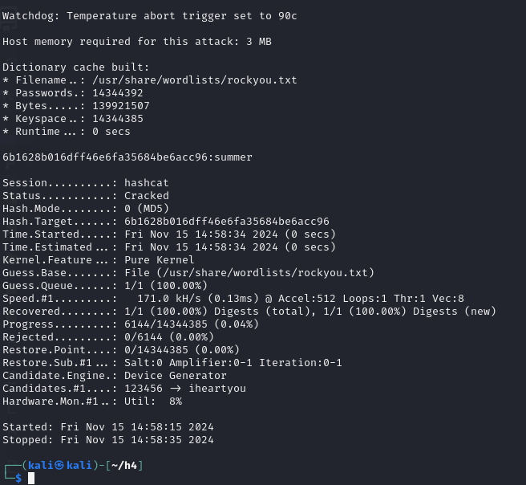
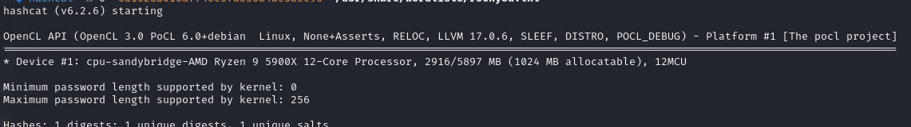
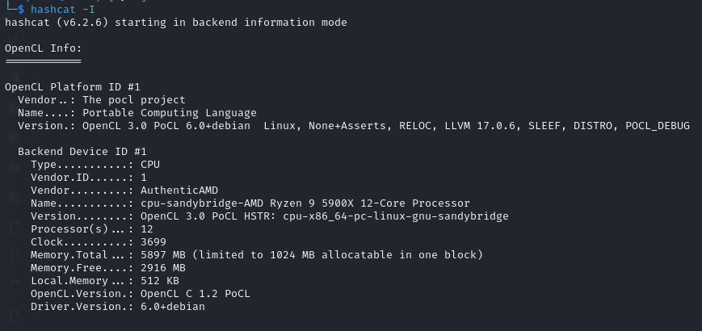

<a name="h4---november-2024"></a>
# 📆 H4 - November 2024!

<a name="contents"></a>
## 📑 Contents

<a name="assignments"></a>
## 📋 Assignments

<details> <summary>Click to expand</summary>
X) Read and Summarize

Karvinen 2022: Cracking Passwords with Hashcat
Karvinen 2023: Crack File Password With John
Santos et al 2017: Hacking User Credentials (30 min)
Polop et al 2024: HackTricks: MSFVenom - CheatSheet
A) Install and Test Hashcat

Install Hashcat and test it by cracking a sample password.
C) Install and Test John the Ripper

Install John the Ripper and test it by cracking the password of a sample file.
D) FuffMe

Install the FuffMe practice target locally. Solve:
Basic Content Discovery
Content Discovery With Recursion
Content Discovery With File Extensions
No 404 Status
Param Mining
Rate Limited
Subdomains - Virtual Host Enumeration
E) File

Crack the encryption of a new file.
F) Hash

Crack the encryption of a new password hash.
G) Create a Reverse Shell with msfvenom

Create a reverse shell malware and connect using Metasploit.
H) Optional

Install a Windows VM and create a reverse shell program for it.
</details>


<a name="x-read-and-summarize-task"></a>
### 📝 X) Read and Summarize Task

<a name="cracking-passwords-with-hashcat"></a>
#### 🔓 Cracking Passwords with Hashcat

Hashcat previously installed.

Cracking example task with the command

```
hashcat -m 0 '6b1628b016dff46e6fa35684be6acc96' /usr/share/wordlists/rockyou.txt
```

`-m 0` means the hash is md5

`'6b1628b016dff46e6fa35684be6acc96'` is the hash to be cracked

`/usr/share/wordlists/rockyou.txt` path to wordlist



password **summer**

171kh/s seems slow, it seems its not using gpu. only one device detected. 

<details>



`hashcat -I` to see device info



installing nvidia drivers by following guide from:
https://docs.nvidia.com/cuda/cuda-installation-guide-linux/

```
wget https://developer.download.nvidia.com/compute/cuda/repos/<distro>/<arch>/cuda-keyring_1.1-1_all.deb
sudo dpkg -i cuda-keyring_1.1-1_all.deb
sudo apt-get update
sudo apt-get --allow-releaseinfo-change update
sudo apt-get install cuda-toolkit
sudo reboot
```

after reboot

```
export PATH=/usr/local/cuda-12.6/bin${PATH:+:${PATH}}
```

Still not showing up as working, trying to manually download from nvidia website 

https://www.nvidia.com/en-us/drivers/details/233004/

</details>

<a name="crack-file-password-with-john"></a>
#### 🔐 Crack File Password with John


<a name="hacking-user-credentials-videos"></a>
#### 📹 Hacking User Credentials Videos

<a name="hacktricks-msfvenom-cheatsheet"></a>
#### 💻 HackTricks MSFVenom CheatSheet

<a name="a-install-and-test-hashcat"></a>
## 🛠️ A) Install and Test Hashcat

<a name="c-install-and-test-john-the-ripper"></a>
## 🛠️ C) Install and Test John the Ripper

<a name="d-solve-fuffme-tasks"></a>
## 🌐 D) Solve FuffMe Tasks

<a name="e-file-decryption-task"></a>
## 📄 E) File Decryption Task

<a name="f-hash-decryption-task"></a>
## 🔒 F) Hash Decryption Task

<a name="g-create-a-reverse-shell-with-msfvenom"></a>
## ⚙️ G) Create a Reverse Shell with msfvenom

<a name="h-optional-windows-vm-exercise"></a>
## 💻 H) Optional: Windows VM Exercise

<a name="tools-and-hardware-used"></a>
## 🛠️ Tools and Hardware Used
- Hardware: AMD 5900X, RTX 3080, 32GB RAM

<a name="resources"></a>
## 📂 Resources

https://docs.nvidia.com/cuda/cuda-installation-guide-linux/