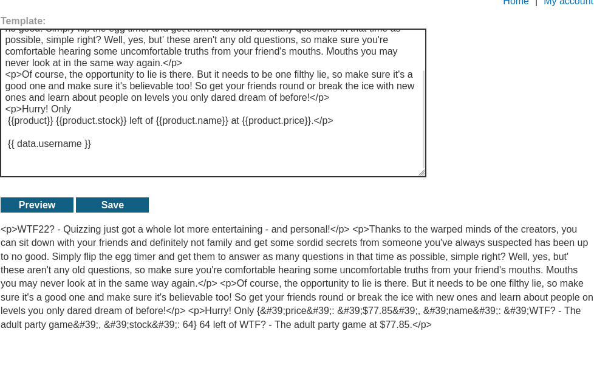
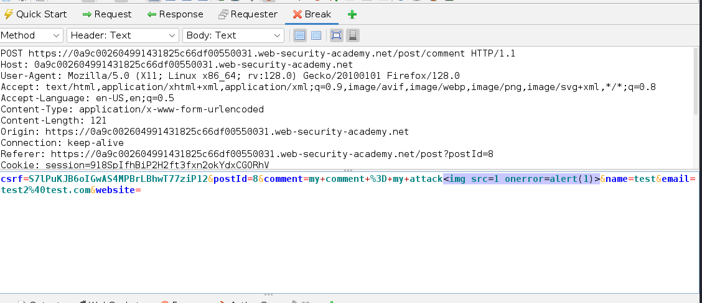

<a name="h5---totally-legitimate-certificate"></a>
# 🔒 H5 - Totally Legitimate Certificate

<a name="contents"></a>
## 📑 Contents

- [🔒 H5 - Totally Legitimate Certificate](#h5---totally-legitimate-certificate)
  - [📑 Contents](#contents)
  - [📋 Assignments](#assignments)
  - [📝 X) Read and Summarize Task](#x-read-and-summarize-task)
  - [🛠️ A) Totally Legit Certificate](#a-totally-legit-certificate)
  - [🦊 B) FoxyProxy Setup](#b-foxyproxy-setup)
  - [🔓 C) Insecure Direct Object References (IDOR)](#c-insecure-direct-object-references-idor)
  - [📂 D) File Path Traversal - Simple Case](#d-file-path-traversal---simple-case)
  - [📂 E) File Path Traversal - Absolute Path Bypass](#e-file-path-traversal---absolute-path-bypass)
  - [📂 F) File Path Traversal - Stripped Sequences](#f-file-path-traversal---stripped-sequences)
  - [🖋️ G) Server-Side Template Injection (SSTI)](#g-server-side-template-injection-ssti)
  - [🌐 H) Server-Side Request Forgery (SSRF)](#h-server-side-request-forgery-ssrf)
  - [🖼️ I) Reflected Cross-Site Scripting (XSS)](#i-reflected-cross-site-scripting-xss)
  - [🖼️ J) Stored Cross-Site Scripting (XSS)](#j-stored-cross-site-scripting-xss)
  - [🔧 K) Encode Strings](#k-encode-strings)
  - [🔍 L) Optional: MitmProxy](#l-optional-mitmproxy)
  - [🌟 M) Optional: Additional PortSwigger Labs](#m-optional-additional-portswigger-labs)
  - [🛠️ Tools and Hardware Used](#tools-and-hardware-used)
  - [📂 Resources](#resources)

<a name="assignments"></a>
## 📋 Assignments

<details> <summary>Click to expand</summary>
X) Read and Summarize Task

OWASP 2021: OWASP Top 10
A01:2021 – Broken Access Control
A10:2021 – Server-Side Request Forgery
PortSwigger Academy:
Insecure Direct Object References (IDOR)
Path Traversal
Server-Side Template Injection
Server-Side Request Forgery
Cross-Site Scripting
A) Totally Legit Certificate

Install OWASP ZAP, generate a CA certificate, and configure it.
B) FoxyProxy Setup

Use FoxyProxy to route specific traffic through ZAP.
C) Insecure Direct Object References (IDOR)

Solve IDOR-related exercises.
D) File Path Traversal - Simple Case

E) File Path Traversal - Absolute Path Bypass

F) File Path Traversal - Stripped Sequences

G) Server-Side Template Injection (SSTI)

H) Server-Side Request Forgery (SSRF)

I) Reflected Cross-Site Scripting (XSS)

J) Stored Cross-Site Scripting (XSS)

K) Encode Strings

L) Optional: MitmProxy

M) Optional: Additional PortSwigger Labs

</details>

<a name="x-read-and-summarize-task"></a>
### 📝 X) Read and Summarize Task

#### A01:2021 – Broken Access Control

- According to OWASP TOP10 its the most common security flaw nowdays

Some example attacks:
URL manipulation
Privilege bypass with API:s
Hidden field manipulation

#### A10:2021 – Server-Side Request Forgery (SSRF)

SSRF can occur when an app accepts users URL without validation

Examples:
file:///etc/passwd
used later:
stockApi=http://localhost/admin/delete?username=carlos

#### Insecure direct object references (IDOR)

IDOR attacks are usually done by changing a number on an address to gain privilege, finding these vulnerabilities with fuzzing tools like ffuf is easy

example:
https://insecure-website.com/customer_account?customer_number=132355
swapping the customer_numer to another number, and thus granting access to otherwise unavailable data.

#### Path traversal

Usually about accessing files containing credentials or other data on the host that should not be public

example
https://insecure-website.com/loadImage?filename=../../../etc/passwd

#### Server-side template injection

SSTI allows injecting of unwanted code into a server to initiate other bad stuff or gain information

example django template used later:
`{{settings.SECRET_KEY}}`

#### Server-side request forgery (SSRF)

SSRF attacks occur when there is avulnerability in the server side application allowing requests to unintended locations

Here is an example of an application function, being called without authorization through a product stock count api:
`stockApi=http://localhost/admin/delete?username=carlos`


#### Cross-site scripting

Being able to run code, for example javascript in places it should not be allowed, in chats, comment forms etc.

example commenting on a page the following
`<script>alert('XSS');</script>`

Will trigger alert XSS for everyone visiting page.

<a name="a-totally-legit-certificate"></a>
## 🛠️ A) Totally Legit Certificate

Zaproxy previously installed, 

- open zaproxy, goto tools -> options

- under network tab server certificate, -> save file

- open firefox, goto settings, search cert

- view certificates... import... choose the zap cert file


<a name="b-foxyproxy-setup"></a>
## 🦊 B) FoxyProxy Setup

Already previously installed,

From firefox addons tab search for foxyproxy standard


Options -> add proxy


add proxy by patterns -> portswigger.net, web-security-academy.net

enable proxy by pattern


now all traffic with portswigger.net is being proxied through zap


<a name="c-insecure-direct-object-references-idor"></a>
## 🔓 C) Insecure Direct Object References (IDOR)

Lab: https://portswigger.net/web-security/access-control/lab-insecure-direct-object-references

The IDOR lab is a simple site with home, my account and live chat


Could not find anything intresting in home and my account sites, also compared to previous tasks, live chat is a new thing here, its probably where the magic should happen.

Reading what the task is about(IDOR) https://portswigger.net/web-security/access-control/idor

We need to find a file or access database that is not secured

Live chat feature when chatting did not find anything intresting, but view transcript downloaded a transcript txt file


Noticed the files stasrted from 2->3->4, maybe we need 1?

Going to Zaproxy to see our GET for the txt


Editing this with open in requester tab

Editing 4.txt to 1.txt and SEND


This reveals 1.txt logs, containing password in the response!


now i can login as carlos


Lab solved

<a name="d-file-path-traversal---simple-case"></a>
## 📂 D) File Path Traversal - Simple Case

Lab: https://portswigger.net/web-security/file-path-traversal/lab-simple

File path traversal description for task:

> This lab contains a path traversal vulnerability in the display of product images.
> To solve the lab, retrieve the contents of the /etc/passwd file.

Path traversal article https://portswigger.net/web-security/file-path-traversal

Opening some product pages and looking through zap, intresting file name src


Copying link to browser


tried some combinations here instead of jpg file

`../../../etc/passwd`
`/etc/passwd`

etc.


nothing was shown but lab was now shown as completed? 


Did not want to move on, went to look on solution, i had correct solution? looking into community solutions i saw they all got passwd content showing in burp, so it had to be something wrong with my zap? 

after some googling and pressing on buttons found the issue

Changing to display text or clicking button combined display i got the contents


Now moving on.

<a name="e-file-path-traversal---absolute-path-bypass"></a>
## 📂 E) File Path Traversal - Absolute Path Bypass

Lab: https://portswigger.net/web-security/file-path-traversal/lab-absolute-path-bypass

> This lab contains a path traversal vulnerability in the display of product images.
>The application blocks traversal sequences but treats the supplied filename as being relative to a default working directory.
>To solve the lab, retrieve the contents of the /etc/passwd file. 

Opened lab site, entered product.

Searched GET request that loads image, editing filename=

first tried `../../../etc/passwd/`
not working
then
`/etc/passwd/`


works!
next

<a name="f-file-path-traversal---stripped-sequences"></a>
## 📂 F) File Path Traversal - Stripped Sequences

Lab: https://portswigger.net/web-security/file-path-traversal/lab-sequences-stripped-non-recursively

>This lab contains a path traversal vulnerability in the display of product images.
>The application strips path traversal sequences from the user-supplied filename before using it.
>To solve the lab, retrieve the contents of the /etc/passwd file.

The lab is similiar to last one, so repeating tasks to find the GET image with the filepath command, file path traversal article on portswigger talks about URL encoding, and fuzzing with burp. I decide to try fuzzing with zap. 

Right click the filename, choose fuzz


Open payloads and try some dir fuzzer just for trying it out


seems really slow compared to ffuf

Moving on with manually doing it, googled for a guide, found owasp cheatsheet for url encoding and path traversal https://owasp.org/www-project-web-security-testing-guide/v42/4-Web_Application_Security_Testing/05-Authorization_Testing/01-Testing_Directory_Traversal_File_Include


trid several different combinations until finally one that works!

`....//....//....//etc/passwd`


Felt really cumbersome to try different combinations, so as bonus, created a custom etc passwd traversal fuzz list for zaproxy (since i did not find one available)

<details>


```
../../../../../../../../../etc/passwd
/etc/passwd
..\\..\\..\\..\\..\\..\\etc\\passwd
%2e%2e%2f%2e%2e%2f%2e%2e%2f%2e%2e%2f%2e%2e%2fetc/passwd
%2e%2e\\%2e%2e\\%2e%2e\\%2e%2e\\etc\\passwd
%2f%2e%2e%2f%2e%2e%2f%2e%2e%2f%2e%2e%2fetc/passwd
%252e%252e%252f%252e%252e%252f%252e%252e%252fetc%252fpasswd
%252e%252e%255c%252e%252e%255c%252e%252e%255cetc%255cpasswd
%2e%2e%2f%65%74%63%2f%70%61%73%73%77%64
%2e%2e%5c%65%74%63%5c%70%61%73%73%77%64
%u002e%u002e%u002fetc%u002fpasswd
%u002e%u002e%u005cetc%u005cpasswd
/etc/passwd%00
%2e%2e%2f%00/etc/passwd
..%2f..%2f..%2f/etc/passwd
..;/..;/..;/etc/passwd
..%5c..%5c..%5c/etc/passwd
....//....//etc/passwd
%2e%2e%2e%2e%2f/etc/passwd
%252e%252e%252fetc%252fpasswd
Li4vLi4vLi4vLi4vLi4vLi4vZXRjL3Bhc3N3ZA==
/proc/self/environ
/proc/self/cwd/etc/passwd
?file=../../../../../etc/passwd
?path=/etc/passwd
?filename=../../../../../etc/passwd
....//....//....//etc/passwd
../../../../etc/passwd..%00
%2e%2e/%2e%2e/%2e%2e/%2e%2e/%2e%2e/etc/passwd
..%252e%252e%252fetc%252fpasswd
....\/....\/....\/etc/passwd
```

</details>

<a name="g-server-side-template-injection-ssti"></a>
## 🖋️ G) Server-Side Template Injection (SSTI)

Lab: https://portswigger.net/web-security/server-side-template-injection/exploiting/lab-server-side-template-injection-with-information-disclosure-via-user-supplied-objects

> This lab is vulnerable to server-side template injection due to the way an  object is being passed into the template. This vulnerability can be exploited to  access sensitive data.
>To solve the lab, steal and submit the framework's secret key.
>You can log in to your own account using the following credentials:
content-manager:C0nt3ntM4n4g3r

Looking through the examples on https://portswigger.net/web-security/server-side-template-injection 

Tried several ones that did not work(gave errors), except {{ data.username }}



but this didnt actually print anything..


lots of more trial & error without success, googling and found an article https://medium.com/@bdemir/a-pentesters-guide-to-server-side-template-injection-ssti-c5e3998eae68

this gave me the debug command that pringed lots of settings 


debug command, cant find and open settings, tried several different combos, then same guide that used above had cheatsheet with the "{{settings.SECRET_KEY}}" command


At this point i was not sure how to use the secret key, spent some time until noticed i just had to press submit solution button on the page..


<a name="h-server-side-request-forgery-ssrf"></a>
## 🌐 H) Server-Side Request Forgery (SSRF)

Lab: https://portswigger.net/web-security/ssrf/lab-basic-ssrf-against-localhost

> This lab has a stock check feature which fetches data from an internal system.
>To solve the lab, change the stock check URL to access the admin interface at http://localhost/admin and delete the user carlos.

Going into a product page, pressing check stock and opening the request in zpa shows us following:


Trying some different combinations until successfully completing lab with manipulating the stock api call to:

`stockApi=http://localhost/admin/delete?username=carlos`


Lab solved!


<a name="i-reflected-cross-site-scripting-xss"></a>
## 🖼️ I) Reflected Cross-Site Scripting (XSS)

Lab: https://portswigger.net/web-security/cross-site-scripting/reflected/lab-html-context-nothing-encoded

> This lab contains a simple reflected cross-site scripting vulnerability in the search functionality.
>To solve the lab, perform a cross-site scripting attack that calls the alert function. 

used article here: https://portswigger.net/web-security/cross-site-scripting/contexts


Tried lots of stuff on the comment part inside blog, but then found a working code in the search form

``


<a name="j-stored-cross-site-scripting-xss"></a>
## 🖼️ J) Stored Cross-Site Scripting (XSS)

Lab: https://portswigger.net/web-security/cross-site-scripting/stored/lab-html-context-nothing-encoded

> This lab contains a stored cross-site scripting vulnerability in the comment functionality.
>To solve this lab, submit a comment that calls the alert function when the blog post is viewed. 

going into comment section, activating intercept in zap, then writing comment


ZAP:


Adding my alert from previous task:




Solved!


<a name="k-encode-strings"></a>
## 🔧 K) Encode Strings

downloaded pencode from their github, unzip and ready to run


copied to usr local bin.

encoding something:

`echo -n "../../../../etc/passwd" | pencode urlencode`


went back to travelsal task to test it out!


Works!

<a name="l-optional-mitmproxy"></a>
## 🔍 L) Optional: MitmProxy

WiP

<a name="m-optional-additional-portswigger-labs"></a>
## 🌟 M) Optional: Additional PortSwigger Labs

WiP

<a name="tools-and-hardware-used"></a>
## 🛠️ Tools and Hardware Used
- Hardware: AMD 5900X, RTX 3080, 32GB RAM

<a name="resources"></a>
## 📂 Resources

https://portswigger.net/web-security
Portswigger academy

https://terokarvinen.com/tunkeutumistestaus/
Karvinen 2024

https://medium.com/@bdemir/a-pentesters-guide-to-server-side-template-injection-ssti-c5e3998eae68

https://owasp.org/Top10/A01_2021-Broken_Access_Control/

https://owasp.org/Top10/A10_2021-Server-Side_Request_Forgery_%28SSRF%29/