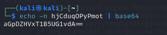
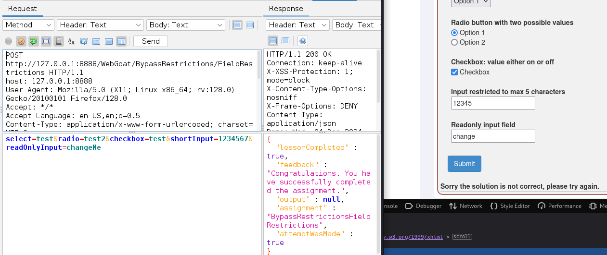

<a name="h6---goat"></a>
# 🐐 H6 - Goat

<a name="contents"></a>
## 📑 Contents

- [🐐 H6 - Goat](#h6---goat)
  - [📑 Contents](#contents)
  - [📋 Assignments](#assignments)
  - [📝 X) Read and Summarize](#x-read-and-summarize)
  - [🛠️ A) Install WebGoat 2023.4](#a-install-webgoat-20234)
  - [🔓 B) (A1) Broken Access Control](#b-a1-broken-access-control)
  - [🔒 C) (A7) Identity & Authentication Failures](#c-a7-identity--authentication-failures)
  - [🌐 D) (A10) Server-Side Request Forgery](#d-a10-server-side-request-forgery)
  - [🖥️ E) Client-Side Tasks](#e-client-side-tasks)
  - [🛠️ F) Editmenu](#f-editmenu)
  - [🛠️ Tools and Hardware Used](#tools-and-hardware-used)
  - [📂 Resources](#resources)

<a name="assignments"></a>
## 📋 Assignments

<details> <summary>Click to expand</summary>
X) Read and Summarize

Karvinen 2020: Using New WebGoat 2023.4 to Try Web Hacking

A) Install WebGoat 2023.4

Install the specified version of WebGoat.

B) (A1) Broken Access Control

Hijack a session (1)
Insecure Direct Object References (IDOR) (4)
Missing Function Level Access Control (2) (Exclude task 4 as it may not work.)

C) (A7) Identity & Authentication Failures

Authentication Bypasses (1)
Insecure Login (1)

D) (A10) Server-Side Request Forgery (SSRF)

Server-Side Request Forgery (2)

E) Client-Side Tasks

Bypass front-end restrictions (2)

F) Editmenu

Add a new command to micro using the palettero plugin.

</details>


<a name="x-read-and-summarize"></a>
### 📝 X) Read and Summarize

https://terokarvinen.com/2023/webgoat-2023-4-ethical-web-hacking/

This article is a guide to install webgoat 2023.4

```
$ sudo apt-get update
$ sudo apt-get install openjdk-17-jre
```

```
$ wget https://github.com/WebGoat/WebGoat/releases/download/v2023.4/webgoat-2023.4.jar
```

```
$ java -Dfile.encoding=UTF-8 -Dwebgoat.port=8888 -Dwebwolf.port=9090 -jar webgoat-2023.4.jar
```

If in public network, dont forget to use firewall

```
$ sudo apt-get install ufw
$ sudo ufw enable
```

<a name="a-install-webgoat-20234"></a>
## 🛠️ A) Install WebGoat 2023.4

to install webgoat i used:

`wget https://github.com/WebGoat/WebGoat/releases/download/v2023.4/webgoat-2023.4.jar`

and to to launch:

`java -Dfile.encoding=UTF-8 -Dwebgoat.port=8888 -Dwebwolf.port=9090 -jar webgoat-2023.4.jar`


now its up and running @ http://127.0.0.1:8888/WebGoat/


<a name="b-a1-broken-access-control"></a>
## 🔓 B) (A1) Broken Access Control

### Hijack cookie

by far hardest task and took most time, ended up watching hints, and then finally some tutorials how to complete.

hijack_cookie found in dev Storage:


returned to this task after completing others, reading lots about this and after watching the hints it makes some sens

```
738971721434259681-1733335872197
738971721434259688-1733337501978
```

as per hints, second number is timestamp for creation, first is for cookie id, ill try to fuzz:

 73897172143425968*2*-173333"5872197"-"7501978"

 

 tried several hours with different methods, 
 
 looking for new ones ended up watching youtube tutorial https://www.youtube.com/watch?v=R5YPRhM5GyE still hard problems getting it to work even with zap

 trying burp

 

the sequencer is so much faster and easier and shows entropy results, then sorting results leaving only a couple tokens difference in time


finally completed.

### IDOR 

Pretty straight forward tasks, used developer console


found id ...88 working by resending request manually trying different syntax and closest numbers userid:


### Missing Function Level Access Control

using inspect element, opening up elements and saw some grayed out ones, voila


 users&config

after several different tries, with third hint added :
Content-Type: application/json
Accept: application/json

to reveal users


#### Spoofing Auth cookie


stuck, tried some different stuff, them saw youtube totorial on cookie docoding for beginners https://www.youtube.com/watch?v=uVWvbD-Rc7A

from here started to decode the cookie:


cookie tail contains admin and webgoat reversed

removed webgoat, added tom




still stuck, found hint in response:

"Hex-encoded string must have an even number of characters",

watched several tutorials / guides how to approach, ended up to a page with walktrough
https://olleb.com/OWASP-WebGoat-spoof-auth-cookie/

Solved how to add cookie into POST with spoof_auth="cookie"


**Later tried the decoding stuff on burp**

Highlight cookie, send to decoder ->


try different encoders.


<a name="c-a7-identity--authentication-failures"></a>
## 🔒 C) (A7) Identity & Authentication Failures

### Auth Bypass


tried many different combinations:

`jsEnabled=1&verifyMethod=SEC_QUESTIONS&userId=12309746 `
```
jsEnabled=1&verifyMethod=SEC_QUESTIONS&userId=12309746
jsEnabled=1&userId=12309746
jsEnabled=1&verifyMethod=SEC_QUESTIONS&userId=12309746
&jsEnabled=1&verifyMethod=SEC_QUESTIONS&userId=12309746
secQuestion0=user&secQuestion1=street&jsEnabled=1&verifyMethod=SEC_QUESTIONS&userId=12309746
```

Googled to find some help, found article with actual guide (walkthrough)

correct answer was to swap the secQuestion*#*
`secQuestion2=user&secQuestion3=street&jsEnabled=1&verifyMethod=SEC_QUESTIONS&userId=12309746`


### Insecure login

Login POST contains useR/pw, insert to form for success


easy peasy

<a name="d-a10-server-side-request-forgery"></a>
## 🌐 D) (A10) Server-Side Request Forgery

First trying intercept 

found easter egg, and solution


<a name="e-client-side-tasks"></a>
## 🖥️ E) Client-Side Tasks

### Field Restrictions


tried to edit fields in browser, didnt work



edited fields in zap, this worked!

<a name="f-editmenu"></a>
## 🛠️ F) Editmenu

`textfilter sed 'y/aeiostAEIOST/43105+43105+/' # leetify`


<a name="tools-and-hardware-used"></a>
## 🛠️ Tools and Hardware Used
- Hardware: AMD 5900X, RTX 3080, 32GB RAM

<a name="resources"></a>
## 📂 Resources

https://terokarvinen.com/2023/webgoat-2023-4-ethical-web-hacking/

https://terokarvinen.com/tunkeutumistestaus/

https://olleb.com/OWASP-WebGoat-spoof-auth-cookie/

https://www.youtube.com/watch?v=uVWvbD-Rc7A

https://terokarvinen.com/2022/command-palette-cheatsheet-run-and-make-micro/

https://github.com/terokarvinen/palettero