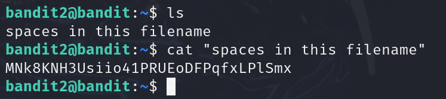
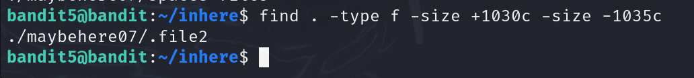

# 💻 H7 - Learning by Hacking

## 📑 Contents

- [💻 H7 - Learning by Hacking](#h7---learning-by-hacking)
  - [📑 Contents](#contents)
  - [📋 Assignments](#assignments)
  - [📝 X) Read and Summarize](#x-read-and-summarize)
  - [📧 A) Google Scholar Alerts (Optional)](#a-google-scholar-alerts-optional)
  - [🕹️ C) OverTheWire: Bandit (Optional)](#c-overthewire-bandit-optional)
  - [🛠️ Tools and Hardware Used](#tools-and-hardware-used)
  - [📂 Resources](#resources)

## 📋 Assignments

 
Click to expand

X) Read and Summarize

Find a review article on a course-related topic.
Ensure the article is from a JUFO-rated publication (levels 1, 2, or 3).
Summarize key points and insights.
Mention if your summary is based on skimming (for articles over 4 pages).
A) Google Scholar Alerts (Optional)

Set up and manage Google Scholar alerts for your field.
Summarize insights gained from article titles.
B) PortSwigger Academy (Optional)

Practice new web security challenges on PortSwigger Academy.
C) OverTheWire: Bandit (Optional)

Complete command-line hacking challenges from OverTheWire: Bandit.
D) WebGoat (Optional)

Solve additional WebGoat tasks to practice web hacking.

### 📝 X) Read and Summarize

Had some struggle to find an intresting new article related closely to course material, and passing JUFO level 1-3.

### PentHack: AI-Enabled Penetration Testing Platform for Knowledge Development

Vol. 23 No. 1 (2024): Proceedings of the 23rd European Conference on Cyber Warfare and Security

**Jufo: taso 1**

https://papers.academic-conferences.org/index.php/eccws/article/view/2493

PDF: https://papers.academic-conferences.org/index.php/eccws/article/view/2493/2104

The review article introduces an AI-enabled python application named PentHack. They tried several different LLMS until they decided to move forward with OpenAI:s GPT-4 API.

It combines LLM to a user-friendly GUI, reducing the complexity of learning pentesting with AI. It has built-in commands, to help getting started with pentesting and learning commands.

Users found the app to be user-friendly and effective. Overall, the article shows that learning pentesting can be greatly improved and accelerated with help of LLM:s.

Screenshots of the app:

## 📧 A) Google Scholar Alerts (Optional)

Setup alerts for cybersecurity, pentesting.

Might edit later

## 🕹️ C) OverTheWire: Bandit (Optional)

Tried a couple levels of bandit before, it seemed like a fun task ill take it a go for a while to see how far i get.

### Bandit 0 

Logging in with bandit0:bandit0 to the server on port 2220

### Bandit 1

Task to find the password for bandit1

ls, cat readme

### Bandit 2

Next task is to open/read a filename with dash only

### Bandit 3

This task is to open file with spaces in filename:

### Bandit 4

Here the hint is to find a hidden file

`ls -A` or `find` reveals the file

### Bandit 5

to find file with text, i used find | xargs file

this file had the password

### Bandit 6

Next task hint is to find readable file with size 1033

used find with -size tags for bigger and smaller than

### Bandit 7

Tried several different commands until found

`find / -type f -user bandit7 -group bandit6 -size 33c 2>/dev/null`

### Bandit 8

Next task was to find a word in a big text file

### Bandit 9

Next was to find the word that only occurs once in a big file

`sort data.txt | uniq -u`

### Bandit 10

Next was to find password in a file, hint was that close to it was several "=", couldnt find with cat grepping, but strings found it

### Bandit 11

Now i need to decode base64 from file

### Bandit 12

"The password for the next level is stored in the file data.txt, where all lowercase (a-z) and uppercase (A-Z) letters have been rotated by 13 positions"

### Bandit 13

"The password for the next level is stored in the file data.txt, which is a hexdump of a file that has been repeatedly compressed. For this level it may be useful to create a directory under /tmp in which you can work. Use mkdir with a hard to guess directory name. Or better, use the command “mktemp -d”. Then copy the datafile using cp, and rename it using mv (read the manpages!)"

*Times up, might continue later.*

## 🛠️ Tools and Hardware Used
- Default Hardware: AMD 5900X, RTX 3080, 32GB RAM
- Tools: Google Scholar, OverTheWire: Bandit

## 📂 Resources
- Google Scholar: [https://scholar.google.com](https://scholar.google.com)  

- Tero Karvinen: [https://terokarvinen.com/tunkeutumistestaus/](https://terokarvinen.com/tunkeutumistestaus/)

- OverTheWire: Bandit: [https://overthewire.org/wargames/bandit/](https://overthewire.org/wargames/bandit/)  
