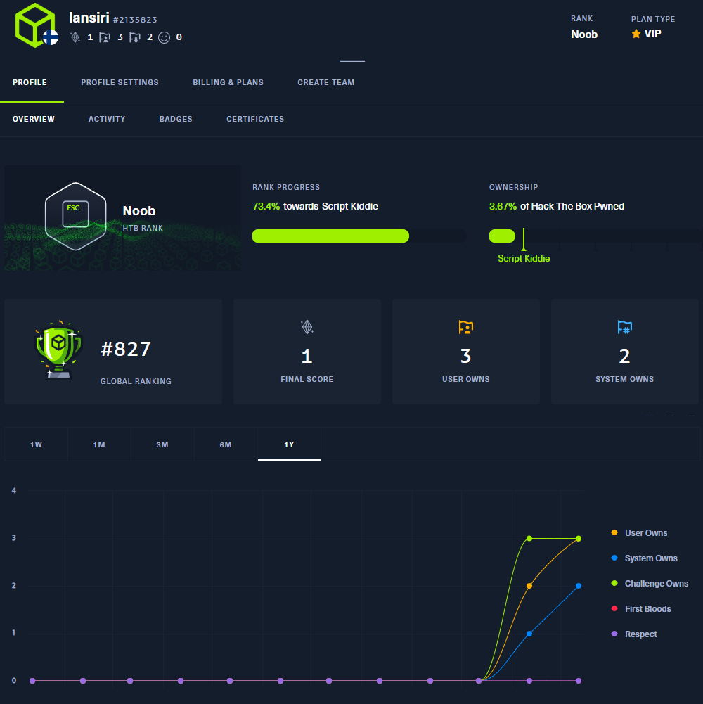

# H8

Some mentions about hacking related stuff done recently

# A) Optional tasks 

Most of optional tasks completed:

H2: [M](https://github.com/lansiri/Tunkeutumistestaus-ici001as3a-3003/blob/main/h2.md#m-optional-get-a-tty-shell-on-metasploitable), [N](https://github.com/lansiri/Tunkeutumistestaus-ici001as3a-3003/blob/main/h2.md#%EF%B8%8F-n-optional-advanced-try-another-attack-tool-or-hostile-remote-access-tool-such-as-sliver), [O](https://github.com/lansiri/Tunkeutumistestaus-ici001as3a-3003/blob/main/h2.md#%EF%B8%8F-o-optional-advanced-install-and-exploit-metasploitable-3)

H3: [F](https://github.com/lansiri/Tunkeutumistestaus-ici001as3a-3003/blob/main/h3.md#f-optional-easy-change-default-editor-to-micro), [G](https://github.com/lansiri/Tunkeutumistestaus-ici001as3a-3003/blob/main/h3.md#%EF%B8%8F-g-optional-install-and-solve-fuffme), [H](https://github.com/lansiri/Tunkeutumistestaus-ici001as3a-3003/blob/main/h3.md#-h-optional-analyze-remote-access-enhancement), [I](https://github.com/lansiri/Tunkeutumistestaus-ici001as3a-3003/blob/main/h3.md#-i-optional-hard-find-vsftpd-backdoor-in-source-code)

H4: [H](https://github.com/lansiri/Tunkeutumistestaus-ici001as3a-3003/blob/main/h3.md#-i-optional-hard-find-vsftpd-backdoor-in-source-code)

H5: [L](https://github.com/lansiri/Tunkeutumistestaus-ici001as3a-3003/blob/main/h5.md#l-optional-mitmproxy)

H7:  

# B) Upgraded tasks

No edits/improvements after feedback

# C) external stuff
## Hackthebox profile

## Suolaaja BADusb

https://github.com/lansiri/Suolaaja-BadUSB

## CTF:s

Application Hacking course CTF **#1**